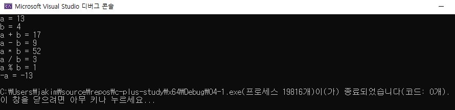
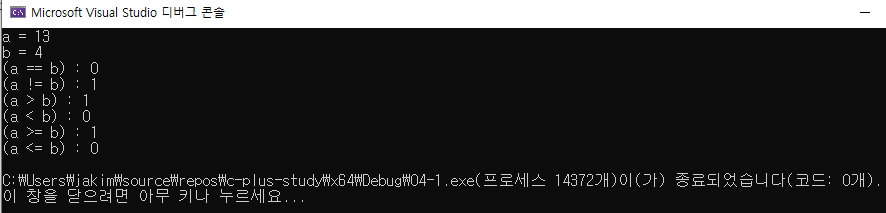
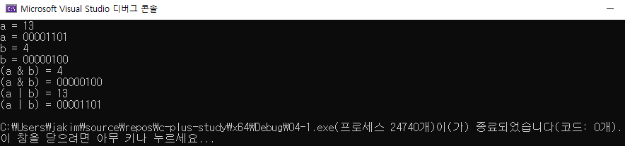

# 04 코딩 테스트 필수 문법
## 04-1 빌트인 데이터 타입

### 정수형

#### 정수형 변수 선언 및 산술 연산

```c++
#include <iostream>

using namespace std;

int main()
{
	int a = 13;
	int b = 4;

	cout << "a = " << a << endl;
	cout << "b = " << b << endl;

	cout << "a + b = " << a + b << endl;
	cout << "a - b = " << a - b << endl;
	cout << "a * b = " << a * b << endl;
	cout << "a / b = " << a / b << endl;
	cout << "a % b = " << a % b << endl;
	cout << "-a = " << -a << endl;

	return 0;
}
```




#### 정수형 비교 연산

```c++
#include <iostream>

using namespace std;

int main()
{
	int a = 13;
	int b = 4;

	cout << "a = " << a << endl;
	cout << "b = " << b << endl;

	cout << "(a == b) : " << (a == b) << endl;
	cout << "(a != b) : " << (a != b) << endl;
	cout << "(a > b) : " << (a > b) << endl;
	cout << "(a < b) : " << (a < b) << endl;
	cout << "(a >= b) : " << (a >= b) << endl;
	cout << "(a <= b) : " << (a <= b) << endl;

	return 0;
}
```




#### 정수형 비트 연산

```c++
#include <iostream>
#include <bitset>

using namespace std;

int main()
{
	int a = 13;
	int b = 4;

	bitset<8> bi_a(a);
	bitset<8> bi_b(b);

	bitset<8> bi_and(a & b);
	bitset<8> bi_or(a | b);

	cout << "a = " << a << endl;
	cout << "a = " << bi_a << endl;
	cout << "b = " << b << endl;
	cout << "b = " << bi_b << endl;

	cout << "(a & b) = " << (a & b) << endl;
	cout << "(a & b) = " << bi_and << endl;
	cout << "(a | b) = " << (a | b) << endl;
	cout << "(a | b) = " << bi_or << endl;

	return 0;
}
```




### 부동소수형


### 문자열


