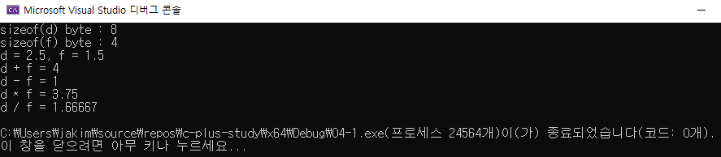

# 04 코딩 테스트 필수 문법
## 04-1 빌트인 데이터 타입

### 정수형

#### 정수형 변수 선언 및 산술 연산

```c++
#include <iostream>

using namespace std;

int main()
{
	int a = 13;
	int b = 4;

	cout << "a = " << a << endl;
	cout << "b = " << b << endl;

	cout << "a + b = " << a + b << endl;
	cout << "a - b = " << a - b << endl;
	cout << "a * b = " << a * b << endl;
	cout << "a / b = " << a / b << endl;
	cout << "a % b = " << a % b << endl;
	cout << "-a = " << -a << endl;

	return 0;
}
```


#### 정수형 비교 연산

```c++
#include <iostream>

using namespace std;

int main()
{
	int a = 13;
	int b = 4;

	cout << "a = " << a << endl;
	cout << "b = " << b << endl;

	cout << "(a == b) : " << (a == b) << endl;
	cout << "(a != b) : " << (a != b) << endl;
	cout << "(a > b) : " << (a > b) << endl;
	cout << "(a < b) : " << (a < b) << endl;
	cout << "(a >= b) : " << (a >= b) << endl;
	cout << "(a <= b) : " << (a <= b) << endl;

	return 0;
}
```


#### 정수형 비트 연산

```c++
#include <iostream>
#include <bitset>

using namespace std;

int main()
{
	int a = 13;
	int b = 4;

	bitset<8> bi_a(a);
	bitset<8> bi_b(b);

	bitset<8> bi_and(a & b);
	bitset<8> bi_or(a | b);

	cout << "a = " << a << endl;
	cout << "a = " << bi_a << endl;
	cout << "b = " << b << endl;
	cout << "b = " << bi_b << endl;

	cout << "(a & b) = " << (a & b) << endl;
	cout << "(a & b) = " << bi_and << endl;
	cout << "(a | b) = " << (a | b) << endl;
	cout << "(a | b) = " << bi_or << endl;

	return 0;
}
```


-----------------------------------

### 부동소수형

#### 부동소수형 사칙 연산

```c++
#include <iostream>

using namespace std;

int main()
{
	double d = 2.5;
	float f = 1.5f;

	cout << "sizeof(d) byte : " << sizeof(d) << endl;
	cout << "sizeof(f) byte : " << sizeof(f) << endl;

	cout << "d = " << d << ", f = " << f << endl;
	cout << "d + f = " << d + f << endl;
	cout << "d - f = " << d - f << endl;
	cout << "d * f = " << d * f << endl;
	cout << "d / f = " << d / f << endl;

	return 0;
}
```




#### 형변환

```c++
#include <iostream>
#include <typeinfo>

using namespace std;

int main()
{
	int i = 65;
	float f = 5.2f;

	// 암시적 형 변환(메모리가 큰 float으로 변환됨)
	double d = i + f;

	cout << "i = " << i << ", type i : " << typeid(i).name() << endl;
	cout << "f = " << f << ", type f : " << typeid(f).name() << endl;

	cout << "double d = i + f, d = " << d << ", type d : " << typeid(d).name() << endl;

	// 명시적 변환
	cout << "static_cast<int>(d) = " << static_cast<int>(d) << endl;
	cout << "static_cast<int>(d) type : " << typeid(static_cast<int>(d)).name() << endl;

	// 명시적 변환
	cout << "static_cast<char>(i) = " << static_cast<char>(i) << endl;
	cout << "static_cast<char>(i) type : " << typeid(static_cast<char>(i)).name() << endl;

	return 0;
}
```


----------------------------

### 문자열

#### 문자열 선언 및 초기화

```c++
#include <iostream>
#include <string>

using namespace std;

int main()
{
	string str1;
	string str2 = "Hello, World!";
	string str3(str2);
	string str4(str2, 0, 5);
	string str5(10, '*');

	cout << "str1 = " << str1 << endl;
	cout << "str2 = " << str2 << endl;
	cout << "str3 = " << str3 << endl;
	cout << "str4 = " << str4 << endl;
	cout << "str5 = " << str5 << endl;

	return 0;
}
```


#### 문자열 찾기

```c++
#include <iostream>
#include <string>

using namespace std;

int main()
{
	string str = "Hello, C++ World!";

	size_t pos1 = str.find("Hello");
	cout << "pos1 : " << pos1 << endl;

	size_t pos2 = str.find('C');
	cout << "pos2 : " << pos2 << endl;

	size_t start_index = 2;
	size_t pos3 = str.find("Hello", start_index);
	cout << "pos3 : " << pos3 << endl;

	size_t pos4 = str.find("Python");
	cout << "pos4 : " << pos4 << endl;

	return 0;
}
```


#### 문자열 추가, 수정

```c++
#include <iostream>
#include <string>

using namespace std;

int main()
{
	string str = "APPLE";
	str += ", World!";
	cout << str << endl;

	str[7] = 'P';
	cout << str << endl;

	str.replace(7, 4, "Col");
	cout << str << endl;

	return 0;
}
```


