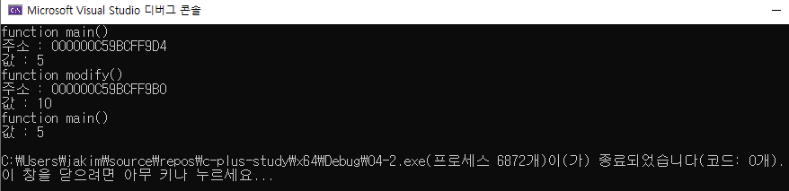

# 04 코딩 테스트 필수 문법
## 04-2 STL

### STL

- STL이란 C++에서 제공하는 템플릿 기반의 표준 라이브러리
- 컨테이너 : 데이터를 저장
- 알고리즘 : 데이터를 처리하고 제어
- 반복자 : 컨테이너에 접근 및 순회


------------------------------

### STL과 자주 사용하는 필수 문법

#### 상수 레퍼런스

```c++
#include <iostream>

using namespace std;

void modify(int value)
{
	value = 10;
	cout << "function modify()" << endl;
	cout << "주소 : " << &value << endl;
	cout << "값 : " << value << endl;
}

int main()
{
	int value = 5;
	cout << "function main()" << endl;
	cout << "주소 : " << &value << endl;
	cout << "값 : " << value << endl;
	modify(value);
	cout << "function main()" << endl;
	cout << "값 : " << value << endl;

	return 0;
}
```




```c++

```


#### 참조값 전달과 주소값 전달의 공통점과 차이점은?


#### auto문


#### 범위 기반 반복문


-------------

### 반복자

#### 순방향 반복자


#### 역방향 반복자


