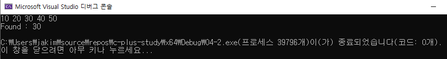

# 04 코딩 테스트 필수 문법
## 04-2 STL

### STL

- STL이란 C++에서 제공하는 템플릿 기반의 표준 라이브러리
- 컨테이너 : 데이터를 저장
- 알고리즘 : 데이터를 처리하고 제어
- 반복자 : 컨테이너에 접근 및 순회


------------------------------

### STL과 자주 사용하는 필수 문법

#### 상수 레퍼런스

```c++
#include <iostream>

using namespace std;

void modify(int value)
{
	value = 10;
	cout << "function modify()" << endl;
	cout << "주소 : " << &value << endl;
	cout << "값 : " << value << endl;
}

int main()
{
	int value = 5;
	cout << "function main()" << endl;
	cout << "주소 : " << &value << endl;
	cout << "값 : " << value << endl;
	modify(value);
	cout << "function main()" << endl;
	cout << "값 : " << value << endl;

	return 0;
}
```


```c++
#include <iostream>

using namespace std;

void modify(int& value)
{
	value = 10;
	cout << "function modify()" << endl;
	cout << "주소 : " << &value << endl;
	cout << "값 : " << value << endl;
}

int main()
{
	int value = 5;
	cout << "function main()" << endl;
	cout << "주소 : " << &value << endl;
	cout << "값 : " << value << endl;
	modify(value);
	cout << "function main()" << endl;
	cout << "값 : " << value << endl;

	return 0;
}
```


#### 참조값 전달과 주소값 전달의 공통점과 차이점은?

- 참조값 전달과 주소값 전달의 두 방식은 '실 인수값을 변경한다' 라는 목적에서는 차이가 없으나 포인터 문법을 사용하냐 마냐에서 차이
- 이 책에서는 참조값 전달로 설명


#### auto문

```c++
#include <iostream>
#include <vector>
#include <map>
#include <string>

using namespace std;

int main()
{
	auto num = 42;
	cout << "num = " << num << endl;
	cout << "num type : " << typeid(num).name() << endl;

	auto pi = 3.14159;
	cout << "pi = " << pi << endl;
	cout << "pi type : " << typeid(pi).name() << endl;

	auto greeting = string("Hello, world!");
	cout << "greeting = " << greeting << endl;
	cout << "greeting type : " << typeid(greeting).name() << endl;

	return 0;
}
```


#### 범위 기반 반복문

```c++
#include <iostream>
#include <vector>
#include <map>
#include <set>

using namespace std;

int main()
{
	vector<int> vec = { 1, 2, 3, 4, 5 };

	for (int num : vec)
	{
		cout << "num = " << num << endl;
	}
	cout << endl;


	map<string, int> fruitMap = { {"apple", 1}, {"banana", 2}, {"cherry", 3} };

	for (const auto& pair : fruitMap)
	{
		cout << pair.first << "=" << pair.second << " ";
		cout << endl;
	}
	cout << endl;


	set<string> fruitSet = { "apple", "banana", "cherry" };
	cout << "Set: ";
	for (const auto& fruit : fruitSet)
	{
		cout << fruit << " ";
		cout << endl;
	}

	return 0;
}
```


-------------

### 반복자

#### 순방향 반복자

```c++
#include <iostream>
#include <algorithm>
#include <vector>

using namespace std;

int main()
{
	vector<int> vec = { 10,20,30,40,50 };

	for (auto it = vec.begin(); it != vec.end(); ++it)
	{
		cout << *it << " ";
	}
	cout << endl;


	auto result = find(vec.begin(), vec.end(), 30);
	if (result != vec.end())
	{
		cout << "Found : " << *result << endl;
	}
	else
	{
		cout << "Not Found" << endl;
	}

	return 0;
}
```




```c++
#include <iostream>
#include <map>

using namespace std;

int main()
{
	map<string, int> myMap = { {"apple", 1}, {"banana", 2}, {"cherry", 3} };

	for (auto it = myMap.begin(); it != myMap.end(); ++it)
	{
		cout << it->first << " : " << it->second << endl;
	}


	auto result = myMap.find("banana");
	if (result != myMap.end())
	{
		cout << "Found : " << result->first << " -> " << result->second << endl;
	}
	else
	{
		cout << "Not found" << endl;
	}

	return 0;
}
```


#### 역방향 반복자

```c++
#include <iostream>
#include <algorithm>
#include <vector>

using namespace std;

int main()
{
	vector<int> vec = { 10,20,30,40,50 };

	for (auto it = vec.rbegin(); it != vec.rend(); ++it)
	{
		cout << *it << " ";
	}
	cout << endl;


	auto result = find(vec.rbegin(), vec.rend(), 30);
	if (result != vec.rend())
	{
		cout << "Found : " << *result << endl;
	}
	else
	{
		cout << "Mot found" << endl;
	}


	return 0;
}
```


