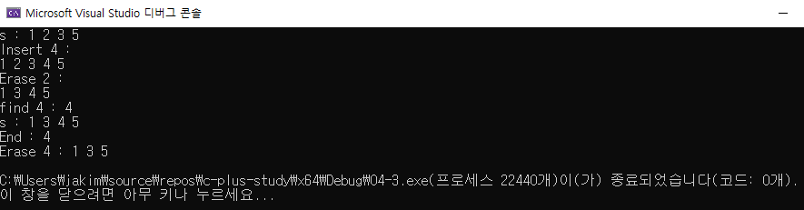

# 04 코딩 테스트 필수 문법
## 04-3 STL의 컨테이너

### 벡터

#### 벡터의 선언 및 초기화

```c++
#include <vector>

using namespace std;

vector<vector<int>> v1;

int rows = 3;
int cols = 4;
vector<vector<int>> v2(rows, vector<int>(cols));


int val = 9;
vector<vector<int>> v3(rows, vector<int>(cols, val));

vector<vector<int>> v4 = {
	{1,2,3},
	{4,5,6},
	{7,8,9}
};
```


#### 벡터의 원소 변경

```c++
#include <iostream>
#include <vector>

using namespace std;

int main()
{
	vector<int> vec = { 1,2,3,4,5 };

	vec[2] = 10;
	int i = 0;

	for (auto it = vec.begin(); it != vec.end(); ++it)
	{
		cout << i++ << " : " << *it << " " << endl;
	}

	return 0;
}
```


#### 벡터의 삽입과 삭제

```c++
#include <iostream>
#include <vector>

using namespace std;

int main()
{
	vector<int> v = { 2,3,4,5 };

	cout << "Origin" << endl;
	for (auto it = v.begin(); it != v.end(); ++it)
	{
		cout << *it << " ";
	}
	cout << endl;


	v.push_back(6);
	cout << "push_back(6)" << endl;
	for (auto it = v.begin(); it != v.end(); ++it)
	{
		cout << *it << " ";
	}
	cout << endl;


	v.pop_back();
	cout << "pop_back()" << endl;
	for (auto it = v.begin(); it != v.end(); ++it)
	{
		cout << *it << " ";
	}
	cout << endl;


	return 0;
}
```


```c++
#include <iostream>
#include <vector>

using namespace std;

int main()
{
	vector<int> v = { 2,3,4,5 };

	cout << "Origin" << endl;
	for (auto it = v.begin(); it != v.end(); ++it)
	{
		cout << *it << " ";
	}
	cout << endl;

	cout << "insert begin 1" << endl;
	v.insert(v.begin(), 1);
	for (auto it = v.begin(); it != v.end(); ++it)
	{
		cout << *it << " ";
	}
	cout << endl;

	cout << "erase begin" << endl;
	v.erase(v.begin());
	for (auto it = v.begin(); it != v.end(); ++it)
	{
		cout << *it << " ";
	}
	cout << endl;

	return 0;
}
```


-------------------------------

### 셋

#### 셋의 선언 및 초기화

```c++
#include <iostream>
#include <set>

using namespace std;

set<int> s1;
set<int> s2 = {3,1,3,2,5};
set<int> s3(s2);
```


#### 셋에서 원소 탐색

```c++
#include <iostream>
#include <set>

using namespace std;

int main()
{
	set<int> numbers = { 1,2,3,4,5 };
	int targets[] = {3, 7};

	for (int number : numbers)
	{
		cout << "numbers : " << number << " ";
	}
	cout << endl;

	for (int target : targets)
	{
		cout << "targets : " << target << " ";
	}
	cout << endl;

	for (int target : targets)
	{
		auto it = numbers.find(target);

		if (it != numbers.end())
		{
			cout << "원소 " << target << " 를 찾았습니다. 값 : " << *it << endl;
		}
		else
		{
			cout << "원소 " << target << " 를 찾지 못했습니다." << endl;
		}
	}

	return 0;
}
```


#### 셋의 삽입과 삭제

```c++
#include <iostream>
#include <set>

using namespace std;

int main()
{
	set<int> s = { 1,3,2,1,5 };
	cout << "s : ";
	for (int ss : s)
	{
		cout << ss << " ";
	}
	cout << endl;

	s.insert(4);
	cout << "Insert 4 : " << endl;
	for (int ss : s)
	{
		cout << ss << " ";
	}
	cout << endl;

	s.erase(2);
	cout << "Erase 2 : " << endl;
	for (int ss : s)
	{
		cout << ss << " ";
	}
	cout << endl;

	auto it = s.find(4);
	cout << "find 4 : " << *it << endl;
	cout << "s : ";
	for (int ss : s)
	{
		cout << ss << " ";
	}
	cout << endl;

	if (it != s.end())
	{
		cout << "End : " << * it << endl;
		s.erase(it);
	}

	cout << "Erase 4 : ";
	for (int ss : s)
	{
		cout << ss << " ";
	}
	cout << endl;
}
```




----------------------

### 맵

#### 맵의 선언 및  초기화

```c++
#include <iostream>
#include <map>
#include <string>

using namespace std;

map<string, double> employeeSalaries;

map<string, double> studentGrades = {
	{"John", 3.7},
	{"Emma", 3.9},
	{"Sophia", 4.0}
}
```


**StudentGrades**

| Key      | Value |
| -------- | ----- |
| "Emma"   | 3.9   |
| "John"   | 3.7   |
| "Sophia" | 4.0   |


#### 맵에서 특정 키에 접근

```c++
#include <iostream>
#include <map>

using namespace std;

int main()
{
	map<string, int> studentScores;

	studentScores["Alice"] = 95;
	studentScores["Bob"] = 88;
	studentScores["Charlie"] = 92;

	int score1 = studentScores["Alice"];
	cout << score1 << endl;

	int score2 = studentScores["rabbit"];
	cout << score2 << endl;

	auto it = studentScores.find("Charlie");
	if (it != studentScores.end())
	{
		int score3 = it->second;
		cout << score3 << endl;
	}

	return 0;
}
```


#### 맵의 값 변경

```c++
#include <iostream>
#include <map>

using namespace std;

int main()
{
	map<string, int> myMap = { {"Apple", 1}, {"Banana",2}, {"Cherry", 3} };

	cout << myMap["Banana"] << endl;

	myMap["Banana"] = 10;
	cout << myMap["Banana"] << endl;


	return 0;
}
```


#### 맵의 삽입과 삭제

```c++
#include <iostream>
#include <map>

using namespace std;

int main()
{
	map<int, string> myMap;

	myMap.insert(make_pair(1, "Apple"));
	myMap.insert({ 2,"Banana" });
	myMap[3] = "Cherry";

	for (const auto& pair : myMap)
	{
		cout << pair.first << " : " << pair.second << endl;
	}

	myMap.erase(2);

	for (const auto& pair : myMap)
	{
		cout << pair.first << " : " << pair.second << endl;
	}

	auto it = myMap.find(3);
	if (it != myMap.end())
	{
		myMap.erase(it);
	}

	for (const auto& pair : myMap)
	{
		cout << pair.first << " : " << pair.second << endl;
	}

	return 0;
}
```


----------------

### 정렬되지 않은 셋과 맵

```c++
#include <iostream>
#include <unordered_set>

using namespace std;

int main()
{
	unordered_set<int> myUnorderedSet;

	myUnorderedSet.insert(3);
	myUnorderedSet.insert(1);
	myUnorderedSet.insert(4);
	myUnorderedSet.insert(2);

	for (int num : myUnorderedSet)
	{
		cout << num << " ";
	}
	cout << endl;

	return 0;
}
```


```c++
#include <iostream>
#include <unordered_map>

using namespace std;

int main()
{
	unordered_map<string, int> myUnorderedMap;

	myUnorderedMap["apple"] = 3;
	myUnorderedMap["banana"] = 1;
	myUnorderedMap["cherry"] = 4;
	myUnorderedMap["date"] = 2;

	for (const auto& pair : myUnorderedMap)
	{
		cout << pair.first << " : " << pair.second << endl;
	}

	return 0;
}
```


